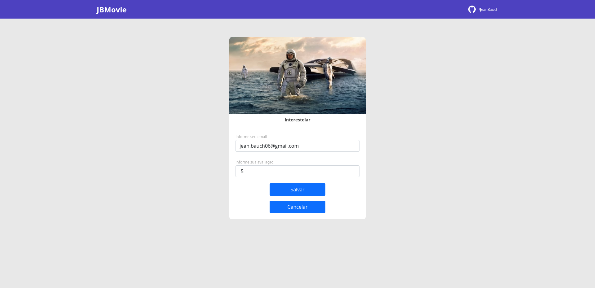

<h1 align="center">
  JBMovie
</h1>

  <a href="#-tecnologias">Tecnologias</a>&nbsp;&nbsp;&nbsp;|&nbsp;&nbsp;&nbsp;
  <a href="#-projeto">Projeto</a>&nbsp;&nbsp;&nbsp;|&nbsp;&nbsp;&nbsp;
  <a href="#-layout">Layout</a>&nbsp;&nbsp;&nbsp;|&nbsp;&nbsp;&nbsp;
  <a href="#-como-executar">Como executar</a>&nbsp;&nbsp;&nbsp;|&nbsp;&nbsp;&nbsp;
  <a href="#-licença">Licença</a>

  

<h3>
  Deploy Frontend: https://jbmovie.netlify.app/;
  Deploy Backend: https://jean-jbmovie.herokuapp.com/
</>

## Features

  

### Backend
- [x] Desenvolvimento de um modelo de banco relacional entre filmes e usuários e avaliações;
- [x] Códificação do banco com SprintBoot;
- [x] Divisão em camadas - `controllers`, `dto`, `entities`, `repositories` e `services`;
- [x] Modelo em `API Rest` para envio dos dados em JSON para o frontend;
  - [x] Rotas: [GET]`/movies?size=12&page=0`, [GET]`/movies/2`, [PUT] `/scores`; 
- [x] Utilização do `JPA` para persistência dos dados;
- [x] Criação de ambientes de desenvolvimento, um para `dev`, `test` e `prod`;
- [x] Utilização da lib `H2` para instância de um banco local;
- [x] Utilização do `Postgres` como banco principal para prod. Utilizando o pgadmin para adminstração do mesmo;
- [x] Hospedagem do banco na nuvem, através do `Heroku` implementando conceitos de CI/CD;

  

### Frontend
- [x] Utilização do `React` como framework;
- [x] Utilização do `Typescript` para tipagem dos dados e organização do mesmo;
- [x] Utilização do `Bootstrap` como framework do css;
- [x] Desenvolvimento da tela de listagens de filmes com dados dinâmicos provida pela API;
- [x] Desenvolvimento da tela de formulário para avalição de filmes de forma dinâmica;
- [x] Componentização: `FormCard`, `MovieCard`, `MovieScore`, `MovieStars`, `NavBar` e `Pagination`;
- [x] Hospedagem do frontend pelo `Netlifly` implementando conceitos de CI/CD;

## Plus para o próximo passo
- [ ] Recriação do frontend com Nuxt;
- [ ] Tema Dark;
- [ ] Listagens dos principais filmes em alta, conforme as avialições do filmes;
- [ ] Autenticação com FireBase Auth;

## ✨ Tecnologias

Esse projeto foi desenvolvido com as seguintes tecnologias:

### Backend
- [Spring initializr](https://start.spring.io/)
  - Utilizando `Maven Project` na `linguagem Java`;
- [Spring boot](https://spring.io/projects/spring-boot)
- [SpringREST](https://spring.io/projects/spring-restdocs)
- [PostgreSQL](https://www.postgresql.org/) 
- [Heroku](https://www.heroku.com)

### Frontend
- [React](https://reactjs.org)
- [TypeScript](https://www.typescriptlang.org/)
- [Bootstrap](https://getbootstrap.com/)

## 💻 Projeto

O JBMovie é uma plataforma web de listagens e avalições de filmes, onde o usuário pode navegar para encontrar determinado filme e ver as avialições gerais do mesmo, podendo também dar sua avalição e trazendo sua resposta imediata no banckend e frontend atualizando o número de avalições e quantas estrelas aquele filme possue.

## 🔖 Layout

  

  

## 🚀 Como executar

- Clone o repositório
- [Dentro da pasta `backend`] Abra a pasta com o `Spring Tool Suite 4`, através de um projeto maeven já existente;
- [Dentro da pasta `backend`] Clique em Re(start) para inicializar o banco local;
- [Dentro da pasta `frontend`] Instale as dependências com `yarn` ou `npm install`;
- [Dentro da pasta `frontend`] Inicie o servidor com `yarn start` ou `npm start`;

Agora você pode acessar [`localhost:3000`](http://localhost:3000) do seu navegador.

## 📄 Licença

Esse projeto está sob a licença MIT. Veja o arquivo [LICENSE](LICENSE.md) para mais detalhes.
